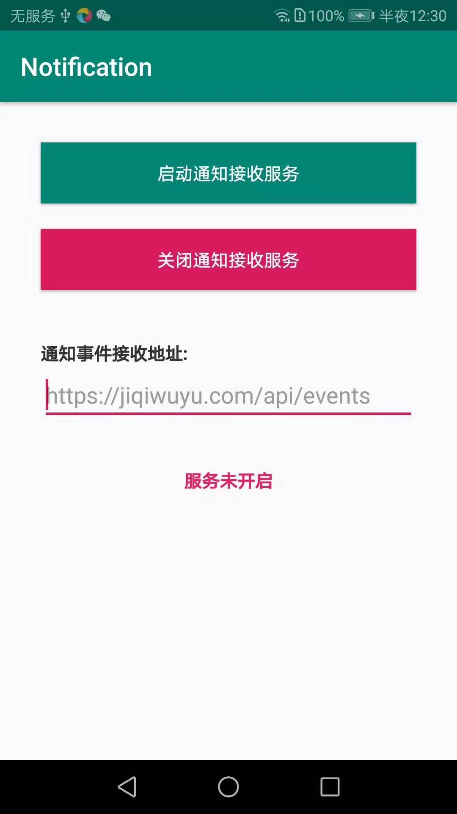
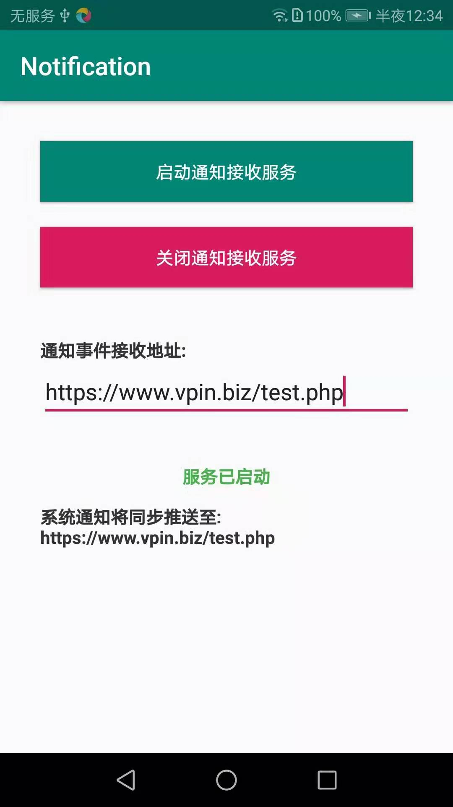

安卓通知Hook
==========
当接收到状态栏通知时，同步将通知事件和消息POST到指定网址。



## 通知数据结构

```json
{
    "package":"com.tencent.mm",
    "android.title":"MaxU",
    "android.reduced.images":true,
    "android.subText":null,
    "android.showChronometer":false,
    "toSingleLine":false,
    "android.icon":2130839882,
    "android.text":"[14条]MaxU: 0.32163",
    "android.progress":0,
    "android.progressMax":0,
    "android.showWhen":true,
    "android.infoText":null,
    "android.progressIndeterminate":false,
    "android.remoteInputHistory":null,
    "gameDndOn":false,
    "com.huawei.isIntentProtectedApp":true
}
```

## 服务端代码示例

```php
<?php
$input = file_get_contents("php://input");
$data = json_decode($input, true);
echo json_encode($data, JSON_PRETTY_PRINT);

```

返回结果

```json
{
    "package":"com.tencent.mm",
    "android.title":"MaxU",
    "android.reduced.images":true,
    "android.subText":null,
    "android.showChronometer":false,
    "toSingleLine":false,
    "android.icon":2130839882,
    "android.text":"[14条]MaxU: 0.32163",
    "android.progress":0,
    "android.progressMax":0,
    "android.showWhen":true,
    "android.infoText":null,
    "android.progressIndeterminate":false,
    "android.remoteInputHistory":null,
    "gameDndOn":false,
    "com.huawei.isIntentProtectedApp":true
}
```
